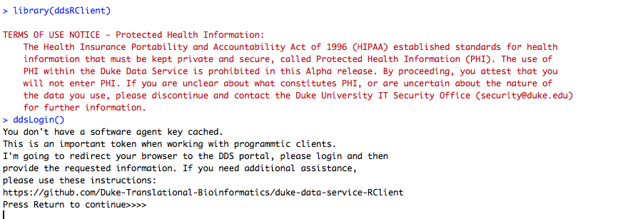
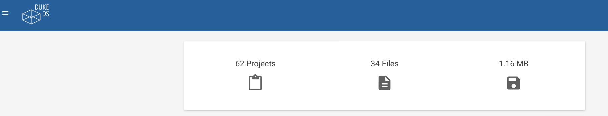
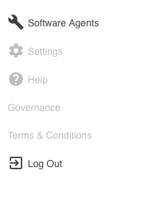
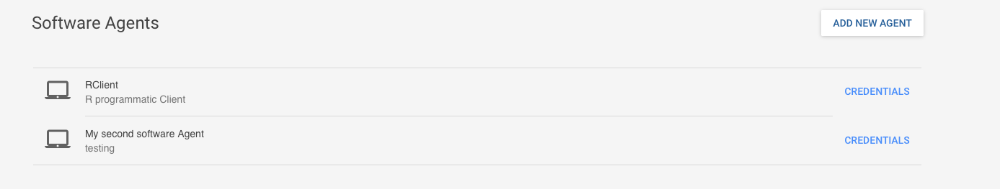

# duke-data-service-RClient
The official repo for the ddsRClient package - the R programmatic client to the duke-data-service.


### Table of contents
- [Installation](#installation)
- [Examples](#examples)
  - [Login](#login)
  - [Upload](#upload)
  - [Download](#download)

## Installation
To install the R package ddsRClient from GitHub:
```
if (!require("devtools")) install.packages("devtools")
devtools::install_github("Duke-Translational-Bioinformatics/duke-data-service-RClient",
ref="master")
```
At any given time, we could be working on a new feature set. If you know the branch
where the feature set is being developed, switch `ref="master"` with the branch to
get the latest updates.

## Examples
The following examples are here to help explore the functionality of the ddsRClient.

### Login
If you've never used the ddsRClient, the ddsLogin function is here to help you
set up a configuration file that makes authentication to DDS easier. Here are the steps
to get started:
```
library(ddsRClient)
```
To learn more about logging in, check out the documentation. NOTE, if no URL is given
ddsRClient assumes the development environment.
```
?ddsLogin

#development
ddsLogin()
```
At this point, you will see the following screen:

Press ENTER (return), your browser will open to DDS. Login and then follow these steps
to get the requested authentication information:




The power of the login function is in creation of the global
variable `curlheader` and also caching credentials for `ddsRequest`.

### Upload
The `ddsUpload` function can be used to upload files and/or folders. It can also
be used to 'version' a file. If a file alread exists in the relative path
of a DDS project, ddsUpload will check the MD5 hash of the file. If there is a discrepancy
betweent the local filesystem and DDS, the file will be versioned within DDS.
```
#the first time around all files/folders will be uploaded
ddsUpload(file_folder="/Users/nn31/Desktop/UploadTester",project="UploadTester")

#if files are changed within this folder structure, another call will version
#changed files
ddsUpload(file_folder="/Users/nn31/Desktop/UploadTester",project="UploadTester")
```

### download
The `ddsDownload` function can be used to download a DDS project's files and folders
onto a client accessible file system.
